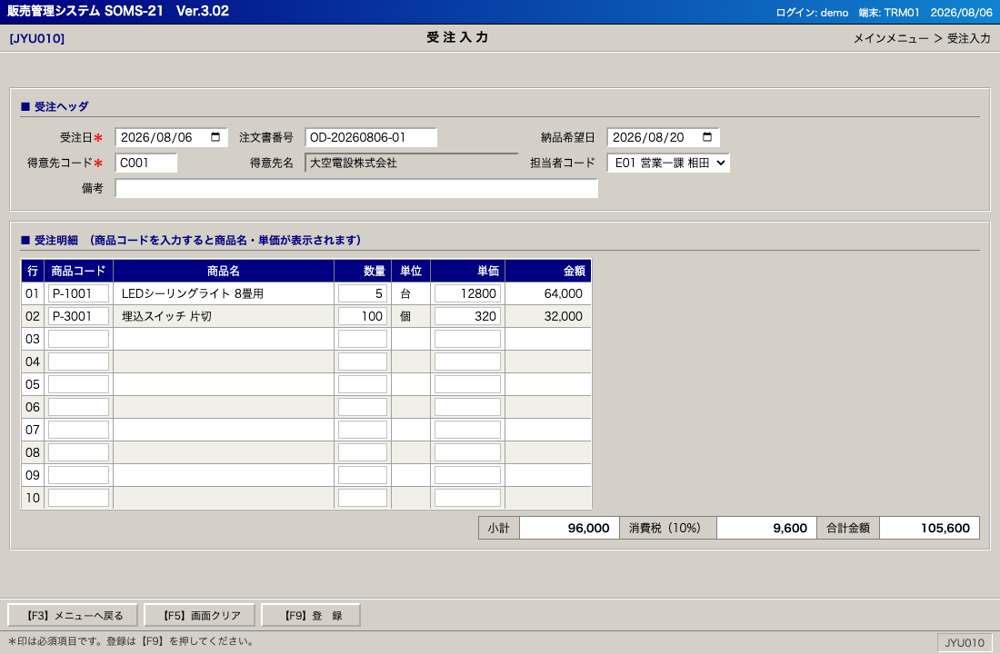
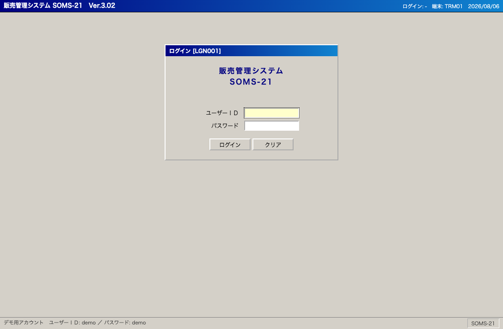
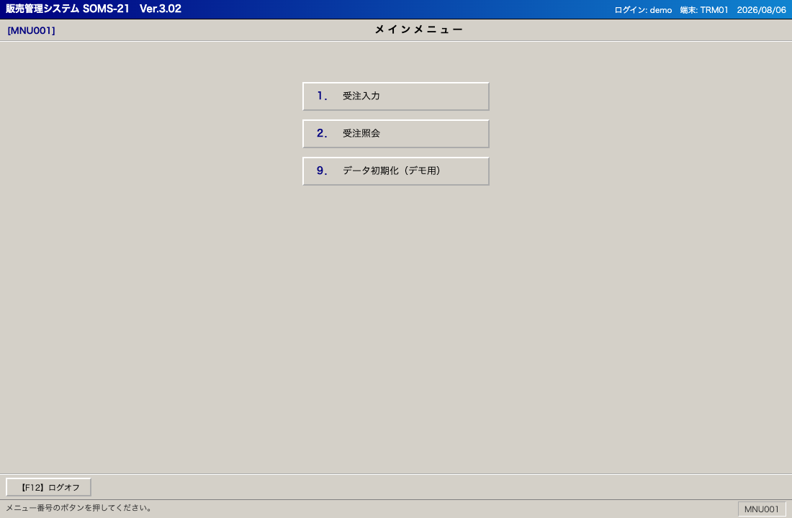
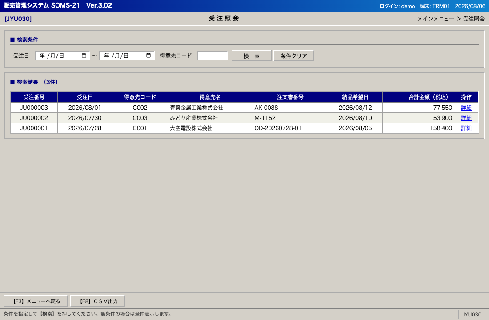

# 販売管理システム SOMS-21（レガシー基幹システム モック）

RPA（UiPath / Power Automate Desktop / Selenium 等）の**入力先ターゲットとして使うための、レガシー風「基幹システム」のモックアプリ**です。
注文書（FAX・PDF 等）から読み取った受注情報を、RPA でこのシステムに入力する──という業務シナリオの検証・デモ・トレーニングに使えます。

2000年代前半の Windows クラシック調・業務端末風の画面イメージ（グレー背景・罫線グリッド・ファンクションキー操作）を再現しています。

> **注意**: 本リポジトリのマスタ・データはすべて架空です。実在の企業・商品・人物とは一切関係ありません。

## 画面イメージ

| 受注入力（JYU010） | ログイン（LGN001） |
|---|---|
|  |  |

| メインメニュー（MNU001） | 受注照会（JYU030） |
|---|---|
|  |  |

## デモ

静的な HTML / CSS / JavaScript のみで動作します（サーバー・ビルド不要）。

- **GitHub Pages**: リポジトリの Pages URL からそのまま利用できます
- **ローカル**: `index.html` をブラウザで開くだけでも動作します（`python3 -m http.server` などでも可）

データはブラウザの `localStorage` に保存されます。サーバーには何も送信されません。

## ログイン情報（デモ用）

| 項目 | 値 |
|---|---|
| ユーザーＩＤ | `demo` |
| パスワード | `demo` |

## 画面構成

| 画面ID | 画面名 | ファイル | 概要 |
|---|---|---|---|
| LGN001 | ログイン | `index.html` | 固定アカウントによる認証。誤入力でエラーメッセージ表示 |
| MNU001 | メインメニュー | `menu.html` | 業務メニュー。データ初期化（デモ用）あり |
| JYU010 | 受注入力 | `order.html` | **RPA入力のメインターゲット**。ヘッダ＋明細10行の受注入力 |
| JYU030 | 受注照会 | `orders.html` | 受注日・得意先コードで検索、CSV出力 |
| JYU031 | 受注詳細 | `order-view.html` | 登録済み受注の照会（読取専用） |

### 受注入力（JYU010）の挙動

- **得意先コード**を入力してフォーカスを外すと、得意先名が自動表示されます（該当なしは `＊該当なし＊`）
- 明細行の**商品コード**を入力すると、商品名・単位・単価が自動表示され、数量未入力なら `1` がセットされます
- 数量 × 単価 → 金額、小計・消費税（10%・切り捨て）・合計が自動計算されます
- 【F9】登録で入力チェック（必須・マスタ存在・数値）を行い、エラーは画面上部に `★〜(E1xx)` 形式で一覧表示されます
- 登録成功時は画面上部に **受注番号（`JU` + 6桁連番）** が表示され、フォームはクリアされます
- Enter キーで次の入力欄へフォーカス移動します（レガシー端末風）

## RPA から操作するための要素ID一覧

すべての入力要素・ボタンに固定の `id` / `name` を付与しています。セレクタは `#id` で安定して特定できます。

### ログイン（index.html）

| 要素 | id |
|---|---|
| ユーザーＩＤ | `user-id` |
| パスワード | `password` |
| ログインボタン | `btn-login` |
| エラーメッセージ | `error-message` |

### メインメニュー（menu.html）

| 要素 | id |
|---|---|
| 受注入力へ | `menu-order-entry` |
| 受注照会へ | `menu-order-list` |
| データ初期化（confirm ダイアログあり） | `menu-reset-data` |
| ログオフ | `fkey-f12` |

### 受注入力（order.html）

| 要素 | id | 備考 |
|---|---|---|
| 受注日 | `order-date` | `type=date`、初期値は当日 |
| 注文書番号 | `po-number` | 客先の注文書No.（任意） |
| 納品希望日 | `delivery-date` | `type=date` |
| 得意先コード | `customer-code` | **必須**。blur で名称自動表示 |
| 得意先名 | `customer-name` | 読取専用（自動表示） |
| 担当者コード | `rep-code` | `select` 要素 |
| 備考 | `note` | |
| 明細：商品コード | `item-code-{n}` | n = 1〜10。blur で名称・単価自動表示 |
| 明細：商品名 | `item-name-{n}` | 読取専用 |
| 明細：数量 | `qty-{n}` | |
| 明細：単位 | `unit-{n}` | 読取専用 |
| 明細：単価 | `unit-price-{n}` | マスタ値が自動セット、上書き可 |
| 明細：金額 | `amount-{n}` | 読取専用（自動計算） |
| 小計／消費税／合計 | `subtotal` / `tax` / `total` | 表示のみ |
| 登録ボタン | `btn-submit` | |
| 画面クリア | `btn-clear` | |
| メニューへ戻る | `btn-back` | |
| エラーメッセージ | `error-message` | 登録失敗時に表示 |
| 完了メッセージ | `complete-message` | 登録成功時に表示 |
| 採番された受注番号 | `registered-order-no` | **RPA での結果取得に使用** |

### 受注照会（orders.html）

| 要素 | id |
|---|---|
| 受注日 From / To | `date-from` / `date-to` |
| 得意先コード | `filter-customer-code` |
| 検索ボタン | `btn-search` |
| 結果テーブル | `orders-table`（tbody は `orders-body`） |
| 件数表示 | `result-count` |
| 詳細リンク | `link-{受注番号}`（例 `link-JU000004`） |
| CSV出力 | `btn-csv` |

## マスタデータ（架空）

### 得意先マスタ

| コード | 得意先名 |
|---|---|
| C001 | 大空電設株式会社 |
| C002 | 青葉金属工業株式会社 |
| C003 | みどり産業株式会社 |
| C004 | 株式会社ひかり設備 |
| C005 | 若葉商事株式会社 |

### 商品マスタ

| コード | 商品名 | 単位 | 単価 |
|---|---|---|---|
| P-1001 | LEDシーリングライト 8畳用 | 台 | 12,800 |
| P-1002 | LEDシーリングライト 12畳用 | 台 | 18,500 |
| P-2001 | VVFケーブル 2.0mm×3芯 100m巻 | 巻 | 9,800 |
| P-2002 | VVFケーブル 1.6mm×2芯 100m巻 | 巻 | 5,600 |
| P-3001 | 埋込スイッチ 片切 | 個 | 320 |
| P-3002 | 埋込スイッチ 3路 | 個 | 480 |
| P-3003 | 埋込コンセント 2口 | 個 | 410 |
| P-4001 | 分電盤 主幹50A 分岐12回路 | 面 | 34,500 |
| P-5001 | 換気扇 天井埋込型 150mm | 台 | 8,900 |
| P-9001 | 配送料 | 式 | 1,500 |

## RPA シナリオ例（注文書1枚の入力）

1. `index.html` を開き、`#user-id` に `demo`、`#password` に `demo` を入力 → `#btn-login` をクリック
2. メニューで `#menu-order-entry` をクリック
3. `#customer-code` に `C001` を入力し Tab（得意先名の自動表示を確認）
4. `#po-number` に注文書番号、`#delivery-date` に納品希望日を入力
5. 明細1行目：`#item-code-1` に `P-1001`、`#qty-1` に数量を入力（以降の行も同様）
6. `#btn-submit` をクリック
7. `#complete-message` の表示を待機し、`#registered-order-no` のテキスト（受注番号）を取得して台帳に転記
8. テストをやり直す場合はメニューの `#menu-reset-data` でデータを初期状態に戻す（confirm ダイアログの承認が必要）

## データの初期化

登録データは `localStorage` に保存されるため、以下のいずれかでリセットできます。

- メインメニューの「９．データ初期化（デモ用）」
- ブラウザの開発者ツールで `localStorage.clear()`

## ライセンス

MIT License
